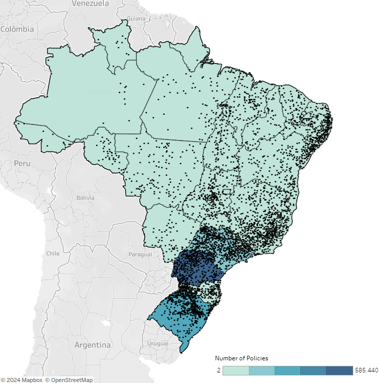

# Analysis of the Federally Subsidized Rural Insurance Market in Brazil

## Problem to be Solved

An insurance company intends to start operations in the rural insurance sector in Brazil and requires a detailed analysis of the federally subsidized rural insurance market to gain insights that facilitate strategic decision-making. Understanding this market is essential for the insurance company, as it allows them to create and offer products that meet the specific needs of farmers, thereby ensuring the economic viability of operations.

## Data Sources

The data used in this analysis were extracted from the Rural Insurance Premium Subsidy Program (PSR) of the Brazilian Ministry of Agriculture, Livestock, and Supply (MAPA). The data covers the period from 2006 to 2023 and is publicly accessible.

**[Link to the data](https://www.gov.br/agricultura/pt-br/assuntos/riscos-seguro/seguro-rural/dados)**  
**Extraction Date:** May 30, 2024

## Key Insights

### Continuous Growth of Policies

- **Annual Evolution:** From 2006 to 2023, the number of policies issued increased from 21,783 to 106,884.
- **Peak in 2021:** The year 2021 recorded the highest number of policies issued, totaling 212,836.
- **Fluctuations:** There was a notable drop from 117,597 policies in 2014 to 39,892 in 2015, followed by a recovery in subsequent years.

### Correlation between Federal Subsidy and Number of Policies Issued

- **Positive Correlation (0.89):** Strong correlation between the value of the federal subsidy and the number of policies issued.
- **Trend Line:** Indicates that as the value of the federal subsidy increases, the number of policies issued also increases.
- **Importance of Federal Subsidy:** The annual increase in the federal subsidy is essential for the growth in the number of policies issued.

### Geographical Distribution and Market Share by States and Cities

- **Leading States:**
  - Paraná (PR): 585,440 policies
  - Rio Grande do Sul (RS): 325,861 policies
  - São Paulo (SP): 210,244 policies
- **Leading Cities:**
  - Bento Gonçalves (RS): 15,399 policies
  - Flores da Cunha (RS): 14,992 policies
  - Toledo (PR): 14,808 policies

### Dynamics of the Insurance Market

- **Main Insurers:** Brasilseg, Mapfre, Essor, Swiss Re, and Allianz hold over 70% of the market.
- **Insurers that Started and Ceased Operations:**
  - Excelsior: Started in 2015 and ceased in 2021
  - Ezze: Started and ceased in 2021
  - Itaú: Started and ceased in 2008
  - Nobre: Started in 2006 and ceased in 2016
  - Tokio Marine: Started in 2016 and ceased in 2022

### Agricultural Activities

- **Top 5 Activities by Policies Issued:**
  - Soybeans: 671,354 policies (43.45% of the market)
  - Second Crop Corn: 209,112 policies (13.53% of the market)
  - Grapes: 136,821 policies (8.85% of the market)
  - Wheat: 134,920 policies (8.73% of the market)
  - First Crop Corn: 86,275 policies (5.58% of the market)

## Summary of Key Insights

### Geographical Concentration of Policies

Agricultural insurance policies are issued in all Brazilian states, with a significant concentration in the southern region. This suggests that the agricultural insurance market is more developed in this region.

### Distribution of Covered Cities

Despite the wide variety of activities covered by agricultural insurance policies, a small number of these activities dominate the market share. This allows insurers to focus their product development efforts on activities with the highest volume of policies issued, optimizing resources and marketing strategies.

### Ranking and Growth of Insurers

It was possible to identify and rank the main insurers operating in the market. Even with some insurers exiting over the years, the total number of insurers has increased, indicating growing interest and competitiveness in the rural market.

### Impact of Federal Subsidy

The federally subsidized rural insurance market has shown significant growth in all analyzed aspects. The constant increase in the number of policies issued is correlated with the annual value of the federal subsidy. This demonstrates that the market is highly influenced by public policies, reinforcing the importance of government support for the sector's development.

These insights indicate that the agricultural insurance market in Brazil is expanding. The concentration of covered activities and the dependence on federal subsidies are key factors that insurers should consider when developing their strategies and products.

## Interactive Dashboard in Tableau

An interactive dashboard in Tableau was created, containing data from 2006 to 2023. This dashboard provides a detailed and interactive visualization of the data, facilitating the understanding of trends and opportunities in the rural insurance market in Brazil.

**[[Link to the Dashboard](https://public.tableau.com/views/RuralInsuranceSubsidyProgramofBrazilPSR-2006-2023/RuralInsuranceSubsidyProgramofBrazilPSR-2006-2023?:language=pt-BR&:sid=&:display_count=n&:origin=viz_share_link)]**

## Recommendations for Future Studies

To gain a deeper understanding of the market and its underlying factors, we recommend the following analyses:

- **Correlation with Meteorological Data:** Investigate the correlation between claims and meteorological data to assess the impact of climatic events on claims.
- **Data on Policies without Government Subsidy:** Analyze data on rural insurance policies without federal subsidies to compare trends.
- **International Comparative Analysis:** Conduct a comparative analysis of rural insurance markets in other countries to identify best practices.

Exploring these areas can enhance strategic decision-making processes and contribute to the development of a more resilient and inclusive rural insurance sector in Brazil.

## Demonstrated Skills

- **SQL (Google BigQuery):** Advanced data cleaning, analysis, and valuable insights extraction.
- **Excel:** Pre-cleaning and formatting data, ensuring consistency and accuracy.
- **Tableau:** Interactive data visualization to communicate insights clearly and impactfully.

- ## How to Use This Repository

### Explore the Scripts

- Navigate to the scripts folder to view the SQL scripts.
- Navigate to the data folder to see the raw data and processed data.

### View the Dashboard

Access the interactive Tableau dashboard to visualize the insights interactively.

## Contact

For more information, feel free to contact me via [LinkedIn](https://www.linkedin.com/in/diego-barbosa-de-oliveira-aa8b4ba7/)
